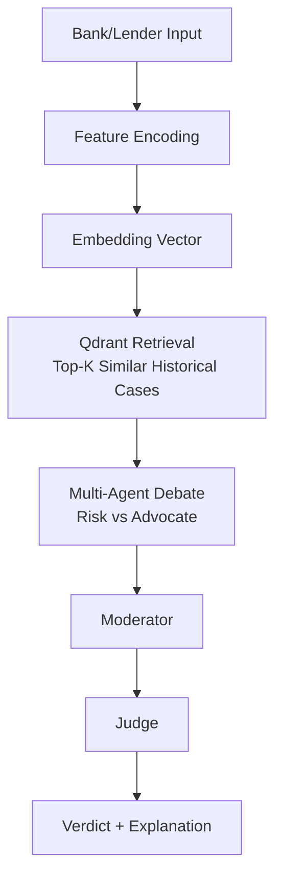

# Credit Courtroom — Backend Documentation

⚖️ **Fair & Explainable Credit Decision Support System** powered by **Qdrant + Multi-Agent Debate**

> Credit Courtroom turns every loan application into a **case**.
> Instead of producing a black-box score, it retrieves **similar historical cases** from Qdrant and runs an
> **adversarial debate** (Risk vs Advocate) moderated and judged to deliver a transparent decision.

---

## 📋 Table of Contents

- [Overview](#-overview)
- [Why Credit Courtroom](#-why-credit-courtroom)
- [Key Features](#-key-features)
	- [Fairness & Explainability](#-fairness--explainability)
	- [Vector Evidence with Qdrant](#-vector-evidence-with-qdrant)
	- [Multi-Agent Courtroom Debate](#-multi-agent-courtroom-debate)
- [Architecture](#-architecture)
- [Data Workflow](#-data-workflow)
- [How We Use Qdrant](#-how-we-use-qdrant-core-intelligence-engine)
- [Project Structure](#-project-structure)
- [Setup & Installation](#-setup--installation)
- [Run the Demo](#-run-the-demo)
- [Configuration](#-configuration)
- [Project Timeline](#-project-timeline)
- [Roadmap](#-roadmap-next-steps)
- [License & Credits](#-license--credits)

---

## 🎯 Overview

**Credit Courtroom** is a credit decision support backend that helps banks/lenders assess loan applications in a way that is:

- **Evidence-driven** (retrieves similar historical applicants)
- **Explainable** (arguments + retrieved evidence)
- **Fairness-aware** (adversarial reasoning prevents one-sided bias)
- **Production-minded** (Qdrant scalability features included in design)

At its core, Credit Courtroom implements the **Credit Decision Memory** paradigm:

> A new applicant is not evaluated in isolation.
> The system embeds their profile, retrieves similar past applicants with known outcomes, then reasons over the evidence through a structured debate.

---

## 🧩 Why Credit Courtroom

Traditional credit scoring can be:

- Opaque (hard to justify to regulators & customers)
- Biased (amplifies historical patterns without scrutiny)
- Static (misses evolving fraud patterns)
- Non-auditable (decisions not traceable to evidence)

Credit Courtroom addresses this by:

- Making decisions **comparable** to past outcomes
- Producing **human-readable** reasoning
- Separating **risk detection** vs **approval justification**
- Enabling future integration of **fraud graphs** and **policy RAG**

---

## ✨ Key Features

### 🧠 Fairness & Explainability

- **Adversarial decision process**: Risk and Advocate agents build opposing cases.
- **Moderator enforces structure**: prevents dominance by one narrative.
- **Judge outputs the verdict**: grounded in arguments + evidence.
- **Auditable transcript**: full debate log can be stored and reviewed.

### 📌 Vector Evidence with Qdrant

- Each applicant profile is encoded into an embedding vector.
- Qdrant retrieves **top-K neighbors** (most similar historical cases).
- The system summarizes neighbor outcomes (paid back vs defaulted) to support reasoning.

### ⚖️ Multi-Agent Courtroom Debate

The decision workflow follows a debate structure inspired by Deb8flow-style orchestration:

- **Risk Agent**: argues to reject or flag risk using retrieved negative evidence.
- **Advocate Agent**: argues to approve by highlighting supportive evidence.
- **Moderator Agent**: controls debate stages (opening → rebuttal → counter → final → verdict).
- **Judge Agent**: issues the final decision (approval / reject / manual review) with justification.

---

## 🏛️ Architecture

Credit Courtroom is built as a modular system with clear separation between:

- **Ingestion** (dataset ingestion / later: live bank input)
- **Encoder** (feature processing + embeddings)
- **Vector DB retrieval** (Qdrant)
- **Debate workflow** (LangGraph multi-agent orchestration)
- **API** (FastAPI entrypoints: currently health + extendable)

### High-Level Flow



---

## 🔁 Data Workflow

### Live Decision Pipeline (Production Intent)

Although this repo currently ingests a CSV for bootstrapping, the real pipeline begins with lender input:

1. **Lender enters applicant details** via bank system / dashboard.
2. Backend validates + transforms features into model-ready format.
3. Applicant is embedded using the trained encoder.
4. Qdrant retrieves similar historical cases (neighbors).
5. Debate workflow runs using neighbors as evidence.
6. System outputs:
	 - Debate transcript
	 - Verdict (approve / reject / manual review)
	 - Evidence summary (neighbors + outcome stats)

### Bootstrapping Dataset Ingestion (Current Stage)

- A historical dataset of labeled applicants is ingested into Qdrant.
- Each record includes:
	- vector embedding
	- payload (structured fields + outcome label)
	- optional summary fields

---

## 🧠 How We Use Qdrant (Core Intelligence Engine)

Qdrant is the central intelligence layer enabling real-time evidence retrieval.

### 1) Hybrid Search (Dense + Sparse) — Planned

We plan to combine:

- **Dense vectors**: capture behavioral and financial similarity (e.g., income stability, repayment patterns).
- **Sparse vectors**: preserve exact keyword/policy matches (e.g., “bankruptcy”, compliance tags).

This prevents missing critical rule-based signals that dense embeddings may blur.

### 2) Graph-Augmented Payloads — Planned

Fraud signals derived from transaction graphs (Neo4j) will be injected into Qdrant payloads, such as:

- shared device fingerprints
- shared IP or geo patterns
- suspicious clusters / rings
- derived “network risk score”

This catches applicants who look financially sound but are structurally linked to fraud networks.

### 3) Adversarial Retrieval — Planned

Agents will trigger opposing retrieval queries:

- **Risk Agent**: filter neighbors with `outcome=default`
- **Advocate Agent**: filter neighbors with `outcome=repaid`

This ensures both sides build the strongest case with targeted evidence.

### 4) Binary Quantization for Scale — Planned

To demonstrate production readiness at national scale, we plan to use **Qdrant Binary Quantization**, compressing vectors up to ~32× to keep retrieval fast with millions of applicants.

---

## 📁 Project Structure

```text
credit-courtroom/
├─ apps/
│  ├─ api/
│  │  ├─ main.py              # FastAPI app entry (health currently)
│  │  └─ routes_health.py     # /health endpoint
│  └─ ui/                     # (optional / future)
│
├─ artifacts/
│  └─ encoder/                # Trained encoder artifacts
│     ├─ encoder_best.pt
│     ├─ feature_cols.joblib
│     └─ scaler.joblib
│
├─ configs/
│  ├─ settings.py             # Environment + paths
│  └─ __init__.py
│
├─ core/
│  ├─ encoder.py              # Encoder model definition
│  └─ encoder_runtime.py      # Runtime wrapper (embed a single applicant)
│
├─ ingestion/
│  ├─ dataset1_profiles/
│  │  ├─ ingest_dataset1.py   # CSV ingestion -> Qdrant
│  │  └─ loan_dataset_20000.csv
│  ├─ dataset2_transactions/  # (planned)
│  └─ policies/               # (planned: policy docs)
│
├─ retrieval/
│  ├─ neighbors.py            # Retrieve and summarize Qdrant neighbors
│  └─ qdrant/
│     ├─ client.py            # Qdrant client + collection settings
│     └─ retrieve_cases.py
│
├─ workflow/
│  ├─ debate_state.py         # Debate state schema
│  ├─ debate_workflow.py      # LangGraph workflow orchestration
│  ├─ llm.py                  # Groq LLM wrapper (model configurable)
│  ├─ nodes.py                # Risk / Advocate / Moderator / Judge nodes
│  ├─ prompts.py              # Agent prompts (courtroom roles)
│  └─ utils.py                # Transcript helpers
│
└─ run_debate_demo.py         # End-to-end local demo
```

---

## 🛠️ Setup & Installation

### Prerequisites

- Python **3.10+**
- Qdrant (local via Docker or persistent folder)
- A Groq API key (for debate agents)

### Install

```bash
python -m venv .venv

# Windows
.venv\Scripts\activate

pip install -r requirements.txt
```

---

## ▶️ Run the Demo

### 1) Configure environment variables

Create a `.env` file at repo root:

```dotenv
# Groq
GROQ_API_KEY=your_key_here
GROQ_MODEL=your_model_here

# Qdrant (local)
QDRANT_URL=http://localhost:6333
QDRANT_COLLECTION=applicants_v1

# Encoder
ENCODER_DIR=artifacts/encoder
QDRANT_VECTOR_SIZE=128
```

### 2) (If not already) ingest historical applicants

```bash
python -m ingestion.dataset1_profiles.ingest_dataset1
```

### 3) Run the debate demo

```bash
python run_debate_demo.py
```

Expected output:

- Retrieved neighbor evidence (top-K)
- Debate transcript:
	- RISK opening
	- ADV rebuttal
	- RISK counter
	- ADV final argument
	- JUDGE verdict

---

## ⚙️ Configuration

You can tune:

- Qdrant collection name + URL
- Embedding size
- Groq model name via `GROQ_MODEL`
- Agent prompts in `workflow/prompts.py`
- Debate schedule in `workflow/nodes.py` (Moderator routing)

---

## 🗓️ Project Timeline

### ✅ Work Completed

- Feature encoder runtime (single applicant → embedding)
- Qdrant ingestion of historical dataset (20k applicants)
- Retrieval layer (neighbors + aggregate stats)
- Multi-agent debate workflow (Risk / Advocate / Moderator / Judge)
- End-to-end runnable demo producing transcript + verdict
- Neo4j integration for transaction graph and fraud signals
- Policy RAG (loan compliance rules as retrievable documents)
- Hybrid search (dense + sparse vectors) in Qdrant
- Adversarial retrieval filters per agent
- Binary quantization for large-scale performance
- Frontend dashboard for analysts and audit logs

---

## 📜 License & Credits

- License: TBD
- Credits: Built for hackathon experimentation using Qdrant + multi-agent debate orchestration.

