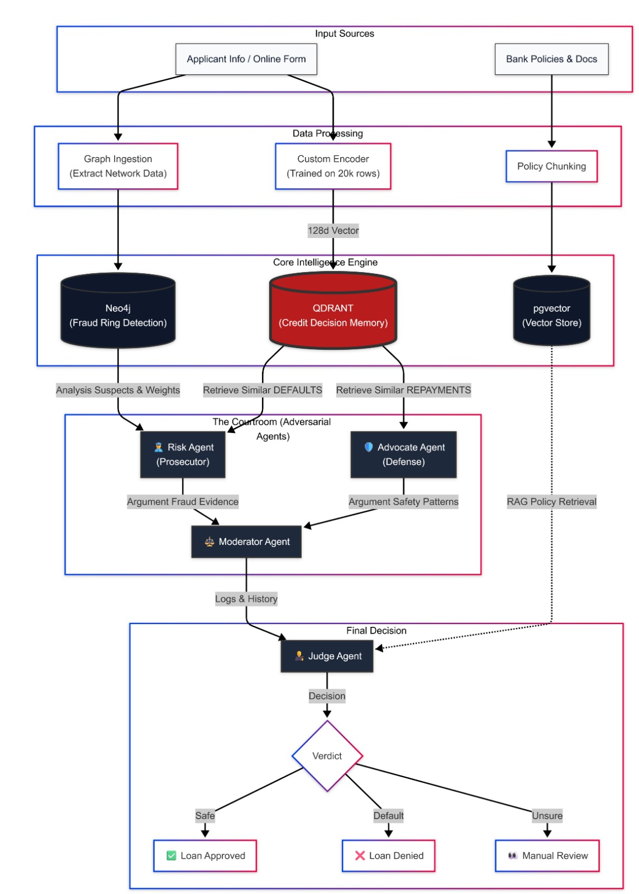

# ⚖️ Credit Courtroom

Fair, Auditable & Explainable Credit Decision Platform

Credit Courtroom is a full-stack AI-powered credit decision support system that transforms loan evaluation from a black-box score into a transparent, evidence-driven, and auditable process.

It combines **Qdrant vector retrieval**, **multi-agent debate reasoning** (LangGraph), and **policy-aware judgment** (RAG over bank policies), delivered through a **FastAPI** backend and a **React (Vite)** frontend.



---

## 🔗 Platform Links

- GitHub Repository (main branch): https://github.com/OussemaHarrabi/Credit-Courtroom
- Frontend (local): http://localhost:5173
- Backend API docs (local): http://localhost:8000/docs

---

## 🎯 Project Objectives

Traditional credit scoring often suffers from:

- Opaque decisions (hard to justify to customers or regulators)
- Static risk models that ignore contextual evidence
- Lack of auditability and traceability
- Bias amplification from single-model decisions

Credit Courtroom’s goals:

- Make credit decisions explainable
- Ground decisions in real historical evidence
- Enable auditable reasoning via structured debate
- Prepare the system for fraud graphs & policy compliance

---

## ✨ Key Capabilities

### ⚖️ Multi-Agent Credit Debate

Each loan application is treated as a court case.

- **Risk Agent**: argues rejection / higher risk using negative evidence
- **Advocate Agent**: argues approval using positive evidence
- **Moderator Agent**: enforces structured debate stages
- **Judge Agent**: issues the final verdict with justification + policy alignment

All arguments are logged and auditable.

### 📌 Evidence Retrieval with Qdrant (Decision Memory)

Applicants are not evaluated in isolation:

1. Applicant features are encoded into a **128-dim embedding**.
2. Qdrant retrieves **top‑K similar historical applicants** (neighbors).
3. Known outcomes (**repaid / defaulted**) become **evidence**.
4. Agents reason over precedents (case-based reasoning), not just abstract scores.

### 📜 Policy‑Aware Decisions (RAG)

Uploaded bank policies are:

- Stored in Supabase Storage
- Parsed into chunks (clauses)
- Embedded with SentenceTransformers
- Retrieved during judgment through a Supabase vector RPC (`match_policy_chunks`)

Policy citations are explicit and enforced in the judge prompt:

`POLICY[id=…, sim=…]: <excerpt>`

### 🕵️ Fraud Signals (Neo4j — partial)

- Fraud signal endpoints exist and return structured “signals”
- Neo4j is included for future graph reasoning and cluster features

---

## 🏗️ System Architecture (High-Level)

Applicant Input (Frontend)
→ FastAPI Backend
→ Feature Encoding
→ Qdrant Vector Search (Top‑K Neighbors)
→ Multi‑Agent Debate (Risk vs Advocate)
→ Policy‑Aware Judge
→ Verdict + Evidence + Audit Log

---

## 🧑‍⚖️ Agent Personas (What Each Agent Does)

The debate is orchestrated via LangGraph in [workflow/debate_workflow.py](workflow/debate_workflow.py), using node implementations in [workflow/nodes.py](workflow/nodes.py) and prompts in [workflow/prompts.py](workflow/prompts.py).

- **Risk Agent**
  - Goal: argue for rejection/manual review
  - Inputs: applicant payload, neighbor statistics, top neighbors (with vector similarity and outcome)
  - Output: structured risk argument (stage: opening/counter)

- **Advocate Agent**
  - Goal: argue for approval
  - Inputs: same evidence + the opponent’s latest argument
  - Output: structured defense argument (stage: rebuttal/final)

- **Moderator Agent**
  - Goal: enforce debate protocol and stage transitions
  - Implements: opening → rebuttal → counter → final_argument → verdict
  - Routes control using LangGraph `Command(goto=...)`

- **Judge Agent**
  - Goal: issue verdict (`approve` / `reject` / `manual_review`) with justification and policy alignment
  - Uses: policy evidence retrieval (`retrieve_policies(...)`) and requires explicit citations

---

## 🧠 Qdrant Usage (What We Actually Implemented)

Qdrant is used as the “decision memory” for historical applicant cases.

### 1) Dense similarity search (implemented)

- Ingestion stores points into a collection (default `applicants_v1`).
- Each point contains:
  - `vector`: 128‑dim embedding (from the trained encoder)
  - `payload`: structured applicant fields + label (`loan_paid_back`) and `applicant_id`

See ingestion script: [ingestion/dataset1_profiles/ingest_dataset1.py](ingestion/dataset1_profiles/ingest_dataset1.py)

### 2) Top‑K neighbor retrieval with payloads (implemented)

- Retrieval uses Qdrant `query_points()` (or `search()` for older clients).
- Always uses `with_payload=True` to return structured evidence.
- The returned `hit.score` is exposed to the frontend as `neighbor.similarity`.

See: [retrieval/neighbors.py](retrieval/neighbors.py)

### 3) Payload-aware filtering (implemented)

We support filtered searches (example: only defaults/repaid) using `query_filter` on payload fields like `loan_paid_back`.

See: [retrieval/qdrant/retrieve_cases.py](retrieval/qdrant/retrieve_cases.py)

### Planned (not required for current demo)

- Hybrid search (dense + sparse)
- Binary quantization for large-scale compression
- Graph-augmented payload features from Neo4j

---

## 📁 Project Structure

```text
credit-courtroom/
├─ apps/
│  ├─ api/                  # FastAPI backend
│  └─ retrieval/            # Retrieval helpers used by API/workflow
├─ frontend/                # React frontend (Vite)
├─ core/                    # Encoder runtime
├─ retrieval/               # Qdrant neighbor search
├─ workflow/                # Multi-agent debate logic
├─ ingestion/               # Dataset & policy ingestion
├─ Full_architecture.jpeg
├─ requirements.txt
└─ README.md
```

---

## ⚙️ Setup & Installation (Reproducible)

### Prerequisites

- Python **3.10+**
- Node.js **18+** (for the frontend)
- Docker Desktop (recommended) for Qdrant/Neo4j
- A Groq API key
- Supabase project (for policy RAG)

### 1) Start infrastructure (Qdrant + Neo4j)

```bash
docker compose up -d qdrant neo4j
```

Qdrant: http://localhost:6333

Neo4j Browser: http://localhost:7474 (default creds in docker-compose)

### 2) Backend setup

```bash
python -m venv .venv

# Windows
.venv\Scripts\activate

pip install -r requirements.txt
```

Create `.env` at repo root:

```dotenv
# Groq LLM
GROQ_API_KEY=your_key_here
GROQ_MODEL=your_model_here

# Qdrant
QDRANT_URL=http://localhost:6333
QDRANT_COLLECTION=applicants_v1

# Encoder
ENCODER_DIR=artifacts/encoder
QDRANT_VECTOR_SIZE=128

# Supabase (policy RAG)
SUPABASE_URL=your_url
SUPABASE_ANON_KEY=your_key
QDRANT_API_KEY=
```

Run backend:

```bash
uvicorn apps.api.main:app --reload --port 8000
```

### 3) Frontend setup

```bash
cd frontend
npm install
npm run dev
```

Frontend runs on http://localhost:5173 and proxies `/api/...` to `http://127.0.0.1:8000`.

---

## ▶️ Usage (UI)

1. Open the frontend: http://localhost:5173
2. Create a new case
3. Enter applicant information
4. Upload documents (optional)
5. Click **Run Courtroom Debate**

You can observe:

- Live debate transcript
- Retrieved evidence from Qdrant (top neighbors + similarity)
- Final verdict + confidence
- Policy citations used by the judge
- Audit events

---

## 📜 Policy Upload & RAG (UI)

Go to http://localhost:5173/policies:

- Upload a PDF/DOCX policy
- The backend stores it in Supabase Storage and chunks it into `policy_chunks`
- Chunks are embedded and become available for judge retrieval

---

## 📊 Auditability

Each case is designed to be auditable:

- Applicant snapshot
- Retrieved neighbors + outcome stats
- Debate transcript
- Final verdict + justification
- Policy evidence used for compliance (RAG)
- Fraud signals (placeholder / partial)

---

## 🗺️ Roadmap

### Phase 2 — Neo4j Fraud Graph (didnt emplement this due to time constraints but it is ready)

- Full transaction graph ingestion
- Fraud rings & cluster risk scoring
- Graph signals injected into Qdrant payloads


### Phase 3 — Production

- Monitoring & observability
- Secure auth + RBAC

---

## 📜 License & Credits

- License: TBD
- Built for hackathon experimentation using Qdrant, Groq, FastAPI, LangGraph, Supabase

